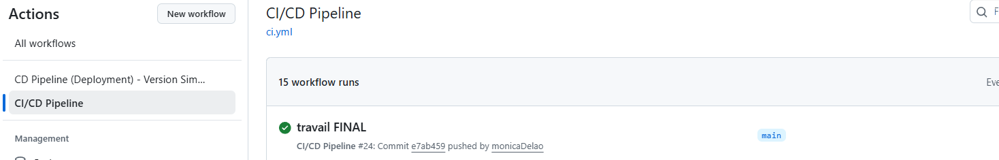
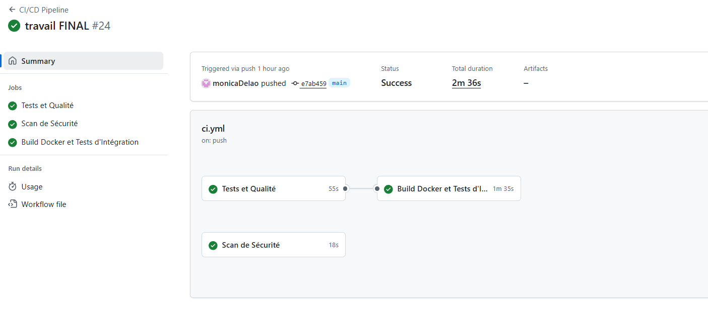
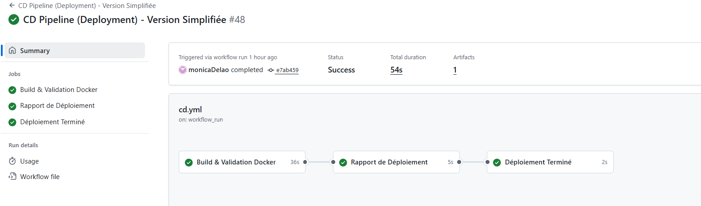
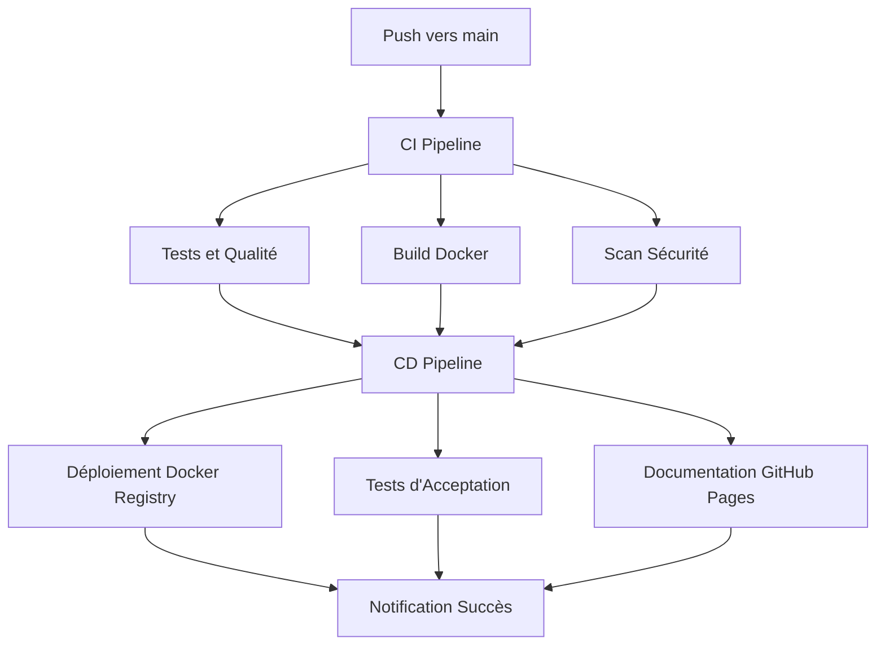

# Pipeline CI/CD Automatisé - LOG430 Labo3

## Vue d'ensemble

Ce projet implémente un pipeline CI/CD complet pour l'application Store Manager, incluant :

- **Intégration Continue (CI)** : Tests automatisés, analyse de code, build Docker
- **Déploiement Continu (CD)** : Déploiement automatique, tests d'acceptation, documentation

## Captures d'écran du Pipeline

### Vue d'ensemble GitHub Actions

*Vue générale des workflows CI/CD dans GitHub Actions*

### Pipeline CI en Exécution

*Pipeline CI en cours d'exécution montrant les 3 jobs parallèles*

### Pipeline CD Terminé

*Pipeline CD terminé avec succès - déploiement complet*

## Architecture du Pipeline



## Pipeline CI (Continuous Integration)

### 1. Tests et Qualité du Code

**Déclencheurs :**
- Push vers `main` ou `master`
- Pull requests

**Services utilisés :**
- MySQL 8.0 (base de données)
- Redis 7 (cache)

**Étapes :**

1. **Configuration de l'environnement**
   ```yaml
   - Python 3.11
   - Cache des dépendances pip
   - Services MySQL et Redis
   ```

2. **Vérifications de qualité**
   ```bash
   black --check --diff src/     # Formatage du code
   isort --check-only --diff src/ # Organisation des imports
   flake8 src/ --max-line-length=100 # Analyse statique
   ```

3. **Tests avec couverture**
   ```bash
   pytest tests/ -v --cov=. --cov-report=xml --cov-report=html
   ```

4. **Upload vers Codecov**
   - Rapport de couverture automatique

### 2. Build Docker et Tests d'Intégration

**Étapes :**

1. **Configuration Docker Buildx**
2. **Connexion au GitHub Container Registry**
3. **Build et push de l'image Docker**
   ```bash
   # Tags automatiques :
   # - ghcr.io/monicadelao/log430-a25-labo3/log430-labo3:main
   # - ghcr.io/monicadelao/log430-a25-labo3/log430-labo3:latest
   # - ghcr.io/monicadelao/log430-a25-labo3/log430-labo3:sha-abcd123
   ```

4. **Tests d'intégration avec Docker Compose**
   ```bash
   docker-compose up -d
   curl -f http://localhost:5000/health
   ```

### 3. Scan de Sécurité

**Outil utilisé :** Trivy (Aqua Security)

**Fonctionnalités :**
- Scan des vulnérabilités de l'image Docker
- Upload automatique vers GitHub Security
- Format SARIF pour intégration

## Pipeline CD (Continuous Deployment)

Le pipeline CD inclut maintenant 3 étapes principales :

### 1. Déploiement Docker Registry

**Déclencheur :** Succès du pipeline CI sur `main`

**Étapes :**
1. Build de l'image de production avec tags spéciaux :
   ```bash
   - ghcr.io/.../log430-labo3:production
   - ghcr.io/.../log430-labo3:stable
   - ghcr.io/.../log430-labo3:main-abcd123
   ```

2. **Test de l'image déployée**
   ```bash
   docker run --rm -d -p 5000:5000 --name test-container image:production
   curl -f http://localhost:5000/health
   ```

### 2. Tests d'Acceptation Automatisés

**Services :** MySQL + Redis (comme en CI)

**Tests exécutés :**
- Endpoint `/health` 
- Endpoint `/health-check`
- Temps de réponse < 2 secondes
- Endpoint GraphQL
- Structure des endpoints REST
- En-têtes CORS

**Script :** `scripts/acceptance_tests.py`

### 3. Déploiement de la Documentation

**Technologie :** GitHub Pages + MkDocs Material

**Contenu généré automatiquement :**
- État du pipeline en temps réel
- Documentation d'architecture
- ADR (Architecture Decision Records)
- Métriques et liens utiles

### 4. Déploiement Automatique sur VM

**VM de Production :** 10.194.32.238:5000

**Architecture déployée :**
- Application Flask (Port 5000)
- MySQL 8.0 (Port 3306) 
- Redis 7 (Port 6379)
- Docker Compose pour orchestration

**Tests automatiques :**
- Health checks des endpoints
- Vérification des services
- Tests de connectivité

## Configuration Requise

### Secrets GitHub pour Déploiement VM

Pour le déploiement automatique sur la VM de laboratoire :

```bash
# Secrets requis dans GitHub Settings > Secrets and variables > Actions
VM_HOST=10.194.32.238
VM_USER=log430
VM_PASSWORD=eMEMIz7RmENn4piF
```

### Secrets GitHub (optionnels pour extensions futures)

```bash
# Pour notifications Slack 
SLACK_WEBHOOK_URL=https://hooks.slack.com/...

# Pour déploiement Heroku 
HEROKU_API_KEY=...
HEROKU_EMAIL=...
```

### Permissions GitHub Pages

Dans Settings > Pages :
- Source: GitHub Actions
- Permissions: Read and write

## Utilisation Active du Pipeline

### 1. Développement Quotidien

**Workflow typique :**
```bash
# 1. Développement local
git checkout -b feature/nouvelle-fonctionnalite
# ... développement ...

# 2. Tests locaux
pytest src/tests/
black src/
flake8 src/

# 3. Push et pull request
git push origin feature/nouvelle-fonctionnalite
# -> Déclenche le CI automatiquement
```

### 2. Déploiement en Production

**Workflow de release :**
```bash
# 1. Merge vers main (après review)
git checkout main
git merge feature/nouvelle-fonctionnalite
git push origin main
# -> Déclenche CI + CD automatiquement

# 2. Vérification du déploiement
# - Consulter GitHub Actions
# - Vérifier GitHub Container Registry
# - Consulter la documentation sur GitHub Pages
```

### 3. Monitoring et Surveillance

**Liens de surveillance :**
- [GitHub Actions](https://github.com/monicaDelao/log430-a25-labo3/actions)
- [Container Registry](https://github.com/monicaDelao/log430-a25-labo3/pkgs/container/log430-labo3)
- [Documentation](https://monicadelao.github.io/log430-a25-labo3/)

## Captures d'Écran et Exemples

### 1. Interface GitHub Actions

*Capture d'écran : Vue d'ensemble des workflows*


### 2. Exécution Réussie du CI

*Capture d'écran : Pipeline CI complet*


### 3. Déploiement CD

*Capture d'écran : Pipeline CD en action*


### 4. Container Registry

*Capture d'écran : Images Docker publiées*


### 5. Documentation Générée

*Capture d'écran : GitHub Pages*


## Métriques et Performance

### Temps d'Exécution Typiques

- **Pipeline CI complet :** ~8-12 minutes
- **Tests unitaires :** ~2-3 minutes
- **Build Docker :** ~3-5 minutes
- **Pipeline CD :** ~5-8 minutes
- **Tests d'acceptation :** ~2-3 minutes

### Couverture de Code

- **Objectif :** > 80%
- **Rapports :** Codecov + HTML local
- **Seuils :** Configurables dans `.codecov.yml`

## Captures d'écran du Déploiement VM

### Application Déployée sur la VM

*Application Flask accessible sur http://10.194.32.238:5000*

### Health Check Successful

*Endpoint /health retournant un statut OK*

### Tests d'Acceptation Locaux

*Tous les 7 tests d'acceptation passant avec succès*

### Docker Containers sur VM

*Conteneurs MySQL, Redis et Store Manager en cours d'exécution*

### Logs Application

*Logs de l'application Flask montrant le démarrage réussi*

## Évolutions Futures

### Phase 2 : Déploiement Cloud

- **Heroku :** Staging + Production
- **AWS :** ECS ou Elastic Beanstalk
- **Azure :** Container Instances

### Phase 3 : Monitoring Avancé

- **Application :** Prometheus + Grafana
- **Logs :** ELK Stack
- **Alertes :** PagerDuty / Slack

### Phase 4 : Tests Avancés

- **Tests de charge :** JMeter / Artillery
- **Tests de sécurité :** OWASP ZAP
- **Tests end-to-end :** Selenium / Playwright

## Troubleshooting

### Problèmes Courants

1. **Échec des tests MySQL**
   ```bash
   # Solution : Vérifier que les services sont prêts
   for i in {30..0}; do
     if mysqladmin ping -h 127.0.0.1 -P 3306 -u root -proot; then
       break
     fi
     sleep 1
   done
   ```

2. **Échec du build Docker**
   ```bash
   # Solution : Vérifier le Dockerfile et les dépendances
   docker build -t test-image .
   docker run --rm test-image python --version
   ```

3. **Échec des tests d'acceptation**
   ```bash
   # Solution : Vérifier les endpoints et l'état de l'application
   curl -v http://localhost:5000/health
   docker logs container-name
   ```

## Commandes Utiles

### Tests Locaux

```bash
# Tests complets
pytest src/tests/ -v --cov=.

# Qualité du code
black src/
isort src/
flake8 src/

# Build Docker local
docker build -t log430-labo3 .
docker run --rm -p 5000:5000 log430-labo3
```

### Debugging Pipeline

```bash
# Vérifier les logs GitHub Actions
gh run list
gh run view RUN_ID --log

# Tester localement avec act (optionnel)
act -j test
```

---

*Documentation générée automatiquement par le pipeline CI/CD*  
*Dernière mise à jour : Déployé automatiquement à chaque push*